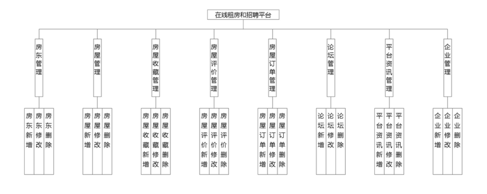
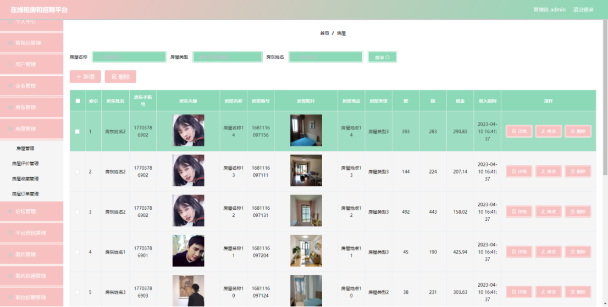
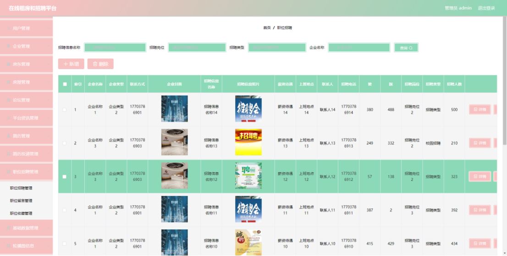
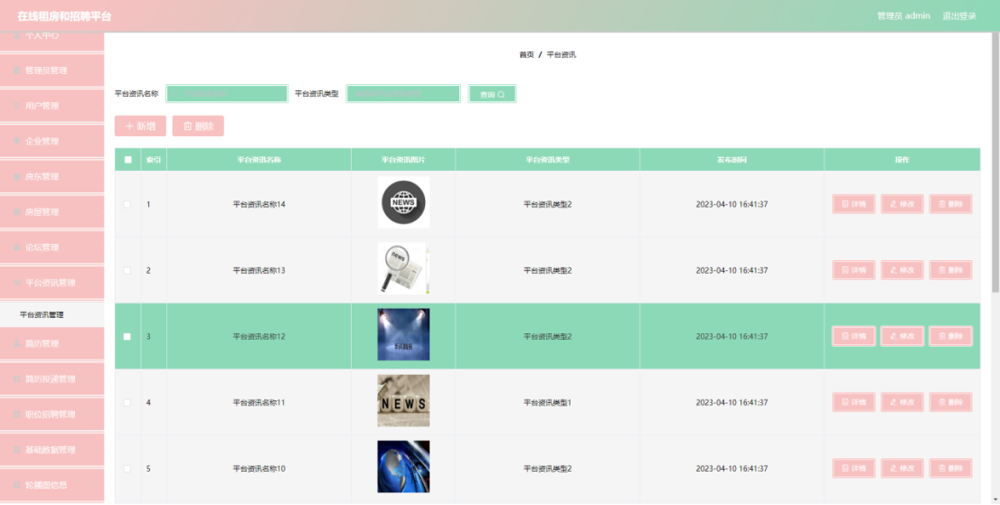
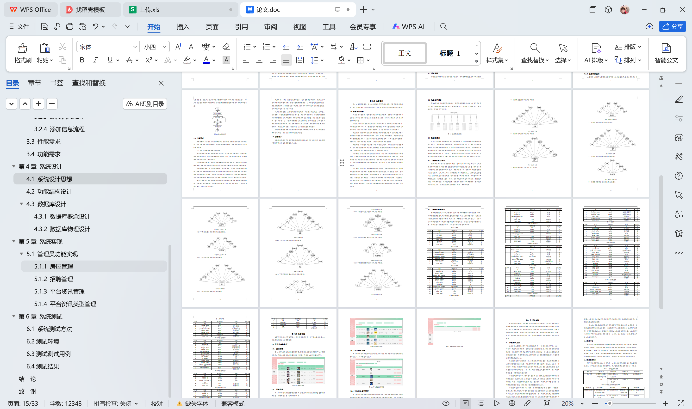

# springboot225-基于SpringBoot的在线租房和招聘平台

>  博主介绍：
>  Hey，我是程序员Chaers，一个专注于计算机领域的程序员
>  十年大厂程序员全栈开发‍ 日常分享项目经验 解决技术难题与技术推荐 承接各类网站设计，小程序开发，毕设等。
>  【计算机专业课程设计，毕业设计项目，Java，微信小程序，安卓APP都可以做，不仅仅是计算机专业，其它专业都可以】

## 本项目获取地址：https://www.bishecode.com/product/221/

## 3000套系统可挑选，获取链接：https://www.bishecode.com/

### 系统架构

> 前端：html | js | css | jquery | vue
>
> 后端：springboot | mybatis
> 
> 环境：jdk1.8+ | mysql | maven

# 一、内容包括
包括有  项目源码+项目论文+数据库源码+答辩ppt+远程调试成功

# 二、运行环境

> jdk版本：1.8 及以上； ide工具：IDEA； 数据库: mysql5.7及以上；编程语言: Java

# 三、需求分析

**3.1 可行性分析**

从三个不同的角度来分析，确保开发成功的前提是有可行性分析，只有进行提前分析，符合程序开发流程才不至于开发过程的中断。

**3.1.1 技术可行性**

在技术实现层次，分析了好几种技术实现方法，并且都有对应的成功案例，也有很多开源模块可以进行参考，所以从技术可行性分析来讲，实现在线租房和招聘平台管理系统是没有问题的。

**3.1.2 经济可行性**

开发的程序并不是向着商业服务程序方向设计与开发的，反而是做为毕业设计论文新项目开发的，主要运用于检测孩子在学校所学的知识，也锻练用户们使用互联网、书籍和别的方法进行自学能力。因而，该程序软件的开发不容易涉及到边际效益，也不会为软件的挑选付钱。你可以在开发软件的官网上下载所需要的软件，并根据要求的安装方法将软件安装在你的电脑中。一般来说，开发这一程序并没有经济发展开支。

**3.1.3 操作可行性**

在线租房和招聘平台管理系统的具体实现，本身参考人类的正常操作逻辑，把常用的操作习惯当做主要的导航实现，可以让使用者更快速的理解并且上手操作，实现符合逻辑的操作流程是操作可行性的具体体现。
以上就是从不同的角度来分析，确保了在线租房和招聘平台管理系统的正常开展。

**3.2 系统流程**

在线租房和招聘平台管理系统投入使用后，使用者如果能看到相应的流程操作图会提高程序的理解能力。
使用者在操作在线租房和招聘平台管理系统中，应该按照本系统提供的操作流程（下图即为本系统的操作流程图）进行操作，可以减少操作失误，从而节省进入在线租房和招聘平台管理系统的时间。

# 四、功能模块

下图即为设计的管理员功能结构，管理员权限操作的功能包括管理平台资讯，管理在线租房和招聘平台信息，包括房屋管理，培训管理，招聘管理，薪资管理等，可以管理平台资讯。

# 五、效果图展示【部分效果图】

图5.1 房屋管理界面【图5.1 即为编码实现的房屋管理界面，管理员在房屋管理界面中可以对界面中显示，可以对房屋信息的房屋状态进行查看，可以添加新的房屋信息等。】

图5.2 招聘管理界面【图5.2 即为编码实现的招聘管理界面，管理员在招聘管理界面中查看招聘种类信息，招聘描述信息，新增招聘信息等。】

图5.3 平台资讯管理界面【图5.3 即为编码实现的平台资讯管理界面，管理员在平台资讯管理界面中新增平台资讯，可以删除平台资讯。】

图5.4 平台资讯类型管理界面【图5.4 即为编码实现的平台资讯类型管理界面，管理员在平台资讯类型管理界面查看平台资讯的工作状态，可以对平台资讯的数据进行导出，可以添加新平台资讯的信息，可以编辑平台资讯信息，删除平台资讯信息。】

 <b>完整文章</b>
 
 
 

## 本项目获取地址：https://www.bishecode.com/product/221/

## 3000套系统可挑选，获取链接：https://www.bishecode.com/

